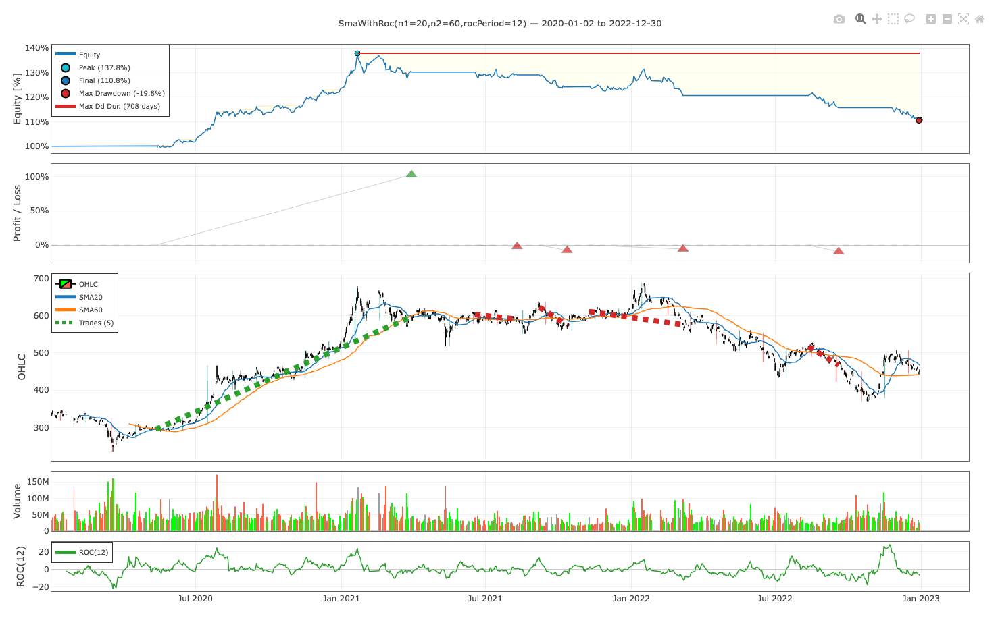

# Node Backtesting

[![NPM version][npm-image]][npm-url]
[![Build Status][action-image]][action-url]
[![Coverage Status][codecov-image]][codecov-url]

> 一個 Node.js 交易策略回測工具，靈感來自於 [backtesting.py](https://github.com/kernc/backtesting.py)。

## 安裝

```sh
$ npm install --save node-backtesting
```

## 匯入模組

```js
// Using Node.js `require()`
const { Backtest, Strategy } = require('node-backtesting');

// Using ES6 imports
import { Backtest, Strategy } from 'node-backtesting';
```

## 快速開始

以下範例使用 [technicalindicators](https://github.com/anandanand84/technicalindicators) 來計算指標和信號，但您可以使用任何函式庫進行替換。

```js
import { Backtest, Strategy, crossover, crossunder } from 'node-backtesting';
import { SMA } from 'technicalindicators';

class SmaCross extends Strategy {
  params = { n1: 20, n2: 60 };

  init() {
    const lineA = SMA.calculate({
      period: this.params.n1,
      values: this.data['close'],
    });
    this.addIndicator('lineA', lineA, { overlay: true, color: '#1f77b4' });

    const lineB = SMA.calculate({
      period: this.params.n2,
      values: this.data['close'],
    });
    this.addIndicator('lineB', lineB, { overlay: true, color: '#ff7f0e' });

    this.addSignal('crossUp', crossover(this.getIndicator('lineA'), this.getIndicator('lineB')));
    this.addSignal('crossDown', crossunder(this.getIndicator('lineA'), this.getIndicator('lineB')));
  }

  next(ctx) {
    const { index, signals } = ctx;
    if (index < this.params.n1 || index < this.params.n2) return;
    if (signals.get('crossUp')) this.buy({ size: 1000 });
    if (signals.get('crossDown')) this.sell({ size: 1000 });
  }
}

const data = require('./data.json');  // historical OHLCV data

const backtest = new Backtest(data, SmaCross, {
  cash: 1000000,
  tradeOnClose: true,
});

backtest.run()        // run the backtest
  .then(results => {
    results.print();  // print the results
    results.plot();   // 繪製回測圖表
  });
```

回測結果：

```
┌────────────────────────┬─────────────────────────┐
│ (index)                │ Values                  │
├────────────────────────┼─────────────────────────┤
│ Strategy               │ 'SmaCross(n1=20,n2=60)' │
│ Start                  │ '2020-01-02'            │
│ End                    │ '2022-12-30'            │
│ Duration               │ 1093                    │
│ Exposure Time [%]      │ 51.70068                │
│ Equity Final [$]       │ 1107500                 │
│ Equity Peak [$]        │ 1378000                 │
│ Return [%]             │ 10.75                   │
│ Buy & Hold Return [%]  │ 32.300885               │
│ Return (Ann.) [%]      │ 3.562748                │
│ Volatility (Ann.) [%]  │ 8.21145                 │
│ Sharpe Ratio           │ 0.433876                │
│ Sortino Ratio          │ 0.675642                │
│ Calmar Ratio           │ 0.179834                │
│ Max. Drawdown [%]      │ -19.811321              │
│ Avg. Drawdown [%]      │ -2.241326               │
│ Max. Drawdown Duration │ 708                     │
│ Avg. Drawdown Duration │ 54                      │
│ # Trades               │ 5                       │
│ Win Rate [%]           │ 20                      │
│ Best Trade [%]         │ 102.3729                │
│ Worst Trade [%]        │ -9.6712                 │
│ Avg. Trade [%]         │ 9.285359                │
│ Max. Trade Duration    │ 322                     │
│ Avg. Trade Duration    │ 114                     │
│ Profit Factor          │ 4.079544                │
│ Expectancy [%]         │ 15.45574                │
│ SQN                    │ 0.461847                │
│ Avg. Win [%]           │ 102.3729                │
│ Avg. Loss [%]          │ -6.27355                │
│ Win/Loss Ratio         │ 16.318177               │
│ Kelly Criterion        │ 0.150975                │
└────────────────────────┴─────────────────────────┘
```



## 使用方式

為了進行回測，您需要準備歷史數據，並且編寫交易策略，再對該策略進行回測以獲得結果。

### 準備歷史數據

首先，請準備任意金融商品（如：股票、期貨、外匯、加密貨幣等）的 OHLCV（開盤價、最高價、最低價、收盤價、成交量）歷史數據。輸入的歷史資料將會被正規化為 `HistoricalData` 欄式物件（每個欄位為陣列），輸入格式可以是 `Array<Candle>`（列形式）或 `CandleList`（欄形式）：

```ts
interface Candle {
  date: string;
  open: number;
  high: number;
  low: number;
  close: number;
  volume?: number;
}

interface CandleList {
  date: string[];
  open: number[];
  high: number[];
  low: number[];
  close: number[];
  volume?: number[];
}

type HistoricalDataInput = Array<Candle> | CandleList;
```

在策略內，`this.data` 會以欄式陣列形式存取，`this.data.close` 與 `this.data['close']` 皆回傳同一個 `number[]`。

### 實作交易策略

您可以依照自己的想法編寫交易策略。實作交易策略需要繼承 `Strategy` 類別並覆寫其兩個抽象方法：

- `Strategy.init()`：該方法在運行策略之前被調用，您可以預先計算策略所依賴的所有指標和信號。
- `Strategy.next(context)`：該方法將在 `Backtest` 實例運行策略時迭代調用， `context` 參數代表當前的 K 棒以及技術指標和信號。您可以依據當前價格、指標和信號決定是否作出買賣動作。

以下是一個實現移動平均雙線交叉的例子。參數 `n1` 表示短天期移動平均線的週期；`n2` 表示長天期移動平均線的週期。當短天期均線向上穿越長天期均線時，買進 `1000` 交易單位。相反地，當短天期均線向下穿越長天期均線時，該策略會賣出 `1000` 交易單位。


```js
import { Backtest, Strategy, crossover, crossunder } from 'node-backtesting';
import { SMA } from 'technicalindicators';

class SmaCross extends Strategy {
  params = { n1: 20, n2: 60 };

  init() {
    const lineA = SMA.calculate({
      period: this.params.n1,
      values: this.data['close'],
    });
    this.addIndicator('lineA', lineA, { overlay: true, color: '#1f77b4' });

    const lineB = SMA.calculate({
      period: this.params.n2,
      values: this.data['close'],
    });
    this.addIndicator('lineB', lineB, { overlay: true, color: '#ff7f0e' });

    this.addSignal('crossUp', crossover(this.getIndicator('lineA'), this.getIndicator('lineB')));
    this.addSignal('crossDown', crossunder(this.getIndicator('lineA'), this.getIndicator('lineB')));
  }

  next(ctx) {
    const { index, signals } = ctx;
    if (index < this.params.n1 || index < this.params.n2) return;
    if (signals.get('crossUp')) this.buy({ size: 1000 });
    if (signals.get('crossDown')) this.sell({ size: 1000 });
  }
}
```

### 運行回溯測試

準備好歷史數據並實作交易策略後，就可以運行回溯測試。調用 `Backtest.run()` 方法會執行回溯測試並回傳 `Stats` 物件，其中包含我們策略的模擬結果和相關的統計數據。


```js
const backtest = new Backtest(data, SmaCross, {
  cash: 1000000,
  tradeOnClose: true,
});

backtest.run()        // run the backtest
  .then(results => {
    results.print();  // print the results
    results.plot();   // 繪製回測圖表
  });
```

預設情況下，回測結束時仍未平倉的交易不會被強制關倉並納入
`Stats.tradeLog` 或交易統計，這與 `backtesting.py` 的
`finalize_trades: false` 行為一致。最終 equity curve 仍會反映最後一根
bar 的 mark-to-market 價值。若要保留舊版 node-backtesting 的行為，並將
期末未平倉交易納入 `# Trades`，請設定：

```js
const backtest = new Backtest(data, SmaCross, {
  cash: 1000000,
  tradeOnClose: true,
  finalizeTrades: true,
});
```

### 最佳化參數

在上述策略中，我們提供的兩個可變參數 `params.n1` 與 `params.n2`，代表兩條移動平均線的期間。我們可以透過調用 `Backtest.optimize()` 方法來最佳化參數，並找出多個參數的最佳組合。在該方法下設置 `params` 選項可以改變 `Strategy` 提供參數的設定，`Backtest.optimize()` 將會回傳提供參數下的最佳組合。

```js
backtest.optimize({
  params: {
    n1: [5, 10, 20],
    n2: [60, 120, 240],
  },
  maximize: 'Sharpe Ratio',          // 或傳函式 `(results) => number`
  constraint: p => p.n1 < p.n2,      // 跳過不合理的組合
  maxTries: 6,                       // 最多隨機抽樣 6 組
  seed: 42,                          // 抽樣可重現
  returnHeatmap: true,               // 附上前兩個參數的 2D 熱力圖
})
  .then(({ best, bestParams, bestScore, heatmap }) => {
    best.print();                    // 印出最佳組合的統計
    best.plot();                     // 畫出最佳組合的回測圖表
    console.log(bestParams, bestScore);
  });
```

`Backtest.optimize()` 回傳 `OptimizeResult` 物件：

| 欄位 | 型別 | 說明 |
| --- | --- | --- |
| `best` | `Stats` | 最高分組合的統計。 |
| `bestParams` | `Record<string, number>` | 勝出的參數組合。 |
| `bestScore` | `number` | 對應 `maximize` 的分數。 |
| `heatmap` | `ParamHeatmap`（選填） | 當 `returnHeatmap: true` 時附帶；由 `params` 的前兩個 key 構成。 |
| `all` | `Array<{ params, score, stats }>`（選填） | 當 `returnAll: true` 時附帶。 |

`Backtest.stats` 也會指向 `result.best`，所以 `backtest.print()` / `backtest.plot()` 在 `optimize()` 後仍可使用。

### 圖表輸出

`Backtest.plot(options?)`（或 `stats.plot(options?)`）會輸出一個自含的 HTML 檔，
使用 [Plotly.js](https://plotly.com/javascript/) 渲染接近 `backtesting.py` 的圖表。
預設 panel 順序為 **Equity [%] → Profit / Loss → OHLC → Volume**。選用的
return、drawdown 與非 overlay 指標 panel 會共用同一條時間軸；非 overlay 指標預設反向排列，
並接在 volume 之後，以貼近 `backtesting.py` 的呈現。

`PlottingOptions` 採用嚴格的 camelCase parity 介面：

```js
backtest.plot({
  filename: 'result.html',
  openBrowser: false,
  plotWidth: 1200,
  plotReturn: true,
  plotDrawdown: true,
  plotPL: true,
  plotVolume: true,
  plotTrades: true,
  relativeEquity: true,
  superimpose: true, // 也可用 false / 'W' / 'M' / 'Q' / 'Y'
  resample: true,    // 10,000 根 K 棒以下保留 raw bars
  showLegend: true,
});
```

預設值：`plotEquity: true`、`plotReturn: false`、`plotPL: true`、
`plotVolume: true`、`plotDrawdown: false`、`plotTrades: true`、
`smoothEquity: false`、`relativeEquity: true`、`superimpose: true`、
`resample: true`、`reverseIndicators: true`、`showLegend: true`。
`smoothEquity` 目前僅作為 API parity 選項被接受；現行 Plotly renderer 尚未套用
equity curve smoothing。

目前行為說明：

- OHLC panel 一律繪製。
- `superimpose` 控制較大週期的 OHLC 疊圖；可傳入 `false`、`true`，或 `'W'`、`'M'`、`'Q'`、`'Y'` 等規則。
- `plotPL` 控制 profit / loss panel；`plotTrades` 控制 OHLC panel 上的交易線段。
- 期末未平倉交易預設維持 open 狀態；若要納入交易統計與圖表交易數，請在 `BacktestOptions` 設定 `finalizeTrades: true`。
- 數值型 `commission` 會保留進出場成交價，並在進場與出場時以現金費用扣除；相對下單數量會納入單位手續費，已平倉交易的 P/L 與報酬率也會扣除兩次手續費。
- `Strategy.buy()` / `Strategy.sell()` 接受 `size`、`limitPrice`、`stopPrice`、`slPrice`、`tpPrice`、`tag`。成交價由市價、限價、停損與 `tradeOnClose` 規則決定。
- 若策略需要動態管理停損或停利，可在 `Strategy.next()` 中更新可寫入的 `trade.sl` / `trade.tp`。

`addIndicator(name, values, options)` 接受：

- `overlay: true`（預設）— 畫在 OHLC panel 上
- `overlay: false` — 放在 volume 之後的獨立副圖（適合 RSI / MACD 等）
- `color` — 任何 CSS 顏色字串，或多線指標使用的顏色陣列
- `scatter: true` — 以 marker 而非連續線呈現
- `plot: false` — 隱藏非 overlay 指標；overlay 指標會以 legend-only trace 起始

最佳化結果的參數熱力圖可用 `plotHeatmap(grid)` 寫入另一個檔案：

```js
const result = await backtest.optimize({
  params: { n1: [5, 10, 20], n2: [60, 120, 240] },
  returnHeatmap: true,
});
new Plotting(result.best).plotHeatmap(result.heatmap, { filename: 'heatmap.html' });
```

### 策略輔助函式

`node-backtesting` 提供一組用於常見策略寫法的純函式，可與 `Strategy` 一起 import：

```js
import { crossover, crossunder, lookback, barsSince, resampleApply } from 'node-backtesting';
```

| Helper | 簽章 | 說明 |
| --- | --- | --- |
| `crossover(a, b)` | `(number[], number[]) => boolean[]` | 當 `a[i] > b[i] && a[i-1] <= b[i-1]` 時於該索引回 `true`。NaN / null / undefined 會 gate 結果。 |
| `crossunder(a, b)` | `(number[], number[]) => boolean[]` | `crossover` 的對應下穿版本。 |
| `lookback(series, i, n)` | `<T>(T[], number, number) => T \| undefined` | 回傳 `series[i - n]`，越界回 `undefined`；`n` 為負時拋 `RangeError`。 |
| `barsSince(condition, i)` | `(boolean[], number) => number` | 回傳 `i` 與 `condition[0..i]` 中最近一個 `true` 的距離；無 `true` 回 `Infinity`。 |
| `resampleApply(dates, values, rule, fn)` | `(string[], number[], 'W'\|'M'\|'Q'\|'Y', (bucket: number[]) => number) => number[]` | 依 ISO 週 / 月 / 季 / 年分桶後對每桶套用 `fn`，再 forward-fill 回原日線索引。 |

這些 helper 全為純函式 — 餵 `this.data` 的 `number[]` 進去，拿 `boolean[]` / `number[]` 出來；要不要再給 `addSignal()` / `addIndicator()` 由你決定。

## 範例

六支可執行的端對端範例位於 [`examples/`](./examples/)，每支聚焦一項功能，可看到完整接線方式：

| 檔案 | 重點 |
| --- | --- |
| [`01-quickstart.ts`](./examples/01-quickstart.ts) | 最小可行回測與標準 HTML 圖表輸出。 |
| [`02-order-management.ts`](./examples/02-order-management.ts) | `market order`、`SL / TP bracket`、`tag`，以及持倉期間的停損更新。 |
| [`03-indicators-and-signals.ts`](./examples/03-indicators-and-signals.ts) | `indicator` 註冊、`boolean signal` 與策略輔助函式。 |
| [`04-optimization.ts`](./examples/04-optimization.ts) | `optimize()` 搭配 `constraint`、抽樣試算、自訂評分與熱力圖輸出。 |
| [`05-plotting.ts`](./examples/05-plotting.ts) | 多面板圖表、`overlay indicator` 與 `subplot indicator`。 |
| [`06-trade-statistics.ts`](./examples/06-trade-statistics.ts) | `StatsIndex`、交易紀錄與 `finalizeTrades` 行為。 |

用 `example` script 執行（會先 build）：

```sh
yarn example examples/01-quickstart.ts
```

詳細執行方式見 [`examples/README.md`](./examples/README.md)。

## 文件

關於 `node-backtesting` 用法的詳細說明，請至 [`/doc/node-backtesting-zh-TW.md`](./doc/node-backtesting-zh-TW.md) 查閱。

## 授權

[MIT](LICENSE)

[npm-image]: https://img.shields.io/npm/v/node-backtesting.svg
[npm-url]: https://npmjs.com/package/node-backtesting
[action-image]: https://img.shields.io/github/actions/workflow/status/chunkai1312/node-backtesting/node.js.yml?branch=master
[action-url]: https://github.com/chunkai1312/node-backtesting/actions/workflows/node.js.yml
[codecov-image]: https://img.shields.io/codecov/c/github/chunkai1312/node-backtesting.svg
[codecov-url]: https://codecov.io/gh/chunkai1312/node-backtesting
